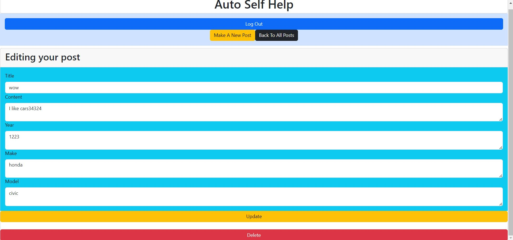
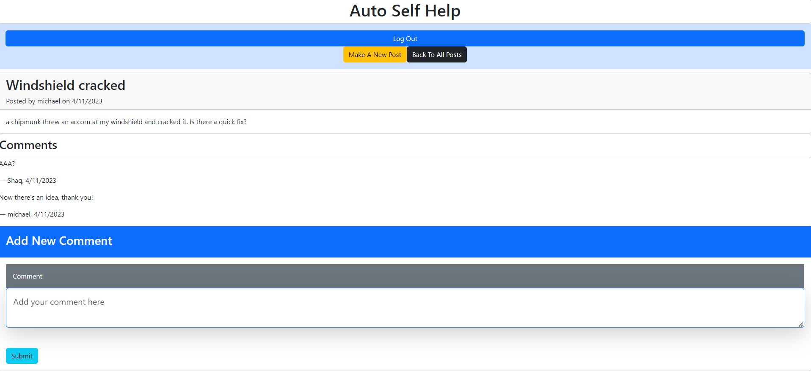

# Auto Self Help

## _Table Of Contents_

1. [Description](#description)
2. [Usage](#usage)
3. [Installation](#installation)
4. [License](#license)
5. [Criteria For Assignment](#criteria-for-assignment)
6. [Repo Link](#repository-link)
7. [Deployed Application](#deployed-application)
8. [Screen Shots](#screen-shots)

## Description

For this project we decided to create an application that allows the user to create a login and then post about issues with their cars. When the user posts about their car issue then they are able to recieve feedback from other users that will comment on the post. The user is able to create a sign up with their email and log in to see what other users have posted. The user can also interact with the application by commenting on posts by other users. We also worked to incorporate a random password generator the user can use when they sign up.

## Usage

The user will be able create a login with their email and create a password. The user will also be able to post about their issues for their car. The user can see other users posts and the responses they received. The user can also respond to other users posts and collaborate on possible solutions for the issues with their vehicles.

## Installation

You will need to install node packages including express-handlebars, generate-password, express.js, MYSQL2, sequelize, bcrypyt, and express-session.

## License

MIT

_Website for license_

[MIT License Website](https://mit-license.org/)

## Criteria-for-assignment

GIVEN a auto maintenance application

*WHEN I visit the site for the first time*
**THEN I am able to create a login with my email and create a password**

*WHEN I sign up*
**Then I am given the option to create a random password that I can use for my login**

*WHEN I log in*
**THEN I am able to see previous posts**

*WHEN I create a new post*
**THEN I am able to see my post and other users can comment with feedback**

*WHEN I edit my previous post*
**THEN I am presented with sections that I can edit and update**

*WHEN I view the edit page for my post*
**THEN I am able to delete the entire post if I wish**

*WHEN click on a post*
**THEN I am able to comment a response**

## Repository-Link

[Github](https://github.com/PintoDrop/autoselfhelp)

## Deployed-Application

[Deployed Application](https://agile-ocean-74686.herokuapp.com/)

## Screen-Shots

